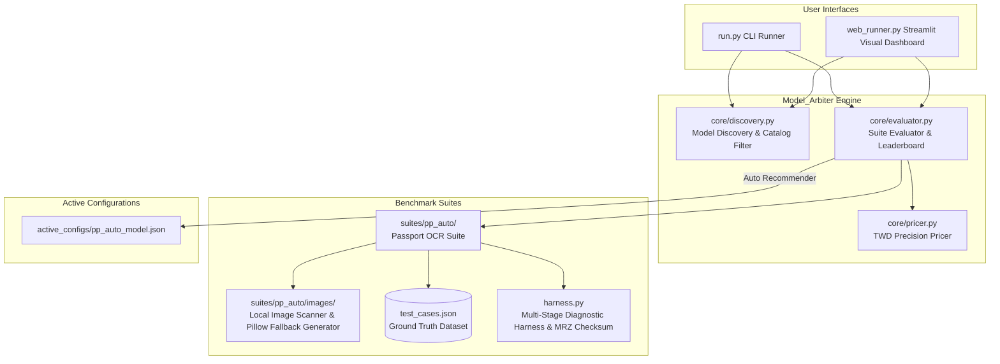

# Model_Arbiter — 專案核心架構與開發者手冊 (HANDBOOK.md)

> **Version**: v1.2.0-release  
> **Last Updated**: 2026-09-17  
> **Target Engine**: Google Gemini API (Multimodal & Reasoning Models)  
> **Repository**: [Model_Arbiter GitHub](https://github.com/voyagermartin/Model_Arbiter.git)

---

## 1. Project Vision & Architecture

### 1.1 專案願景 (Project Vision)
`Model_Arbiter` 為跨專案共用的 **「Google Gemini 模型自動跑分、成本精算與最適模型推薦引擎」**。
在 LLM/VLM 技術快速迭代與 API 費率頻繁調整的背景下，許多企業應用（如 OCR 護照辨識、單據解析、複雜推理）過度依賴頂規高價模型（如 Pro 系列），造成龐大營運成本。

`Model_Arbiter` 透過自動化跑分測試與 Token 精度計費機制，即時比較各主流模型（如 **Gemini 3.5 Flash-Lite**, 2.5 Flash, 2.0 Flash, 2.0 Flash-Lite 等）在真實任務下的 **正確率**、**響應延遲** 與 **台幣成本 (TWD)**，並自動產出最佳動態設定檔 `active_configs/<suite>_model.json`，供其他商業專案直接引用，達成「零破壞性更新、極致套利降本」目標。

### 1.2 系統架構圖 (Architecture Diagram)



---

## 2. Key Modules & Directory Structure

```plaintext
Model_Arbiter/
├── .gitignore          # Git 忽略設定（隱藏 API 密碼與 active_configs 實體 JSON）
├── HANDBOOK.md         # 專案核心架構與開發者手冊 (本文件)
├── README.md           # Quick Start 與雲端一鍵部署說明
├── requirements.txt    # 依賴清單 (google-genai, pydantic, pillow, tabulate, streamlit)
├── run.py              # CLI 主入口腳本 (支援跨平台 UTF-8 輸出)
├── web_runner.py       # Streamlit 視覺化跑分監控面板 (圖檔上傳、路徑提示與除錯展開區)
├── core/
│   ├── __init__.py
│   ├── discovery.py    # 自動撈取 Google 官方活躍多模態模型 (包含 gemini-3.5-flash-lite)
│   ├── pricer.py       # 官方費率對照表與 TWD 精算 (涵蓋 Thinking Tokens)
│   └── evaluator.py    # 跑分評估、ASCII 天梯榜與 active_model.json 輸出
├── suites/
│   ├── __init__.py
│   └── pp_auto/        # 護照/證件辨識測試套件
│       ├── __init__.py
│       ├── images/     # 實體測試圖片目錄 (支援 JPG/PNG 自動掃描)
│       │   └── .gitkeep
│       ├── test_cases.json   # Ground Truth 驗證標準
│       └── harness.py        # 測試執行、三階段診斷與 Pillow 合成圖備援
└── active_configs/
    └── .gitkeep        # Git 目錄追蹤檔
```

### 模組職責說明 (Module Responsibilities)
- **`run.py`**：CLI 指令解析器（`--list-models`, `--suite pp_auto`, `--mock`, `--models`）。
- **`web_runner.py`**：Streamlit 視覺化 Web 面板，提供側邊欄控制、一鍵跑分、性價比天梯榜、最佳套利卡片與診斷展開區。
- **`core/discovery.py`**：透過 `google-genai` SDK 自動撈取 `ACTIVE` 且支援 `generateContent` 的模型，包含新一代 baseline 模型 `gemini-3.5-flash-lite`。
- **`core/pricer.py`**：維護官方 Gemini 費率表（以 1M tokens USD 計價，預設匯率 `32.0 TWD/USD`），準確計算法價、思考 (Thinking) 及輸出 Token 成本。
- **`core/evaluator.py`**：協調 Benchmark 執行，計算正確率、延遲與台幣成本，輸出 ASCII 對比天梯榜並產出推薦檔。
- **`suites/pp_auto/harness.py`**：包含 ICAO Doc 9303 護照 MRZ 7-3-1 數學校驗算法、JSON 結構合法性、三階段除錯與 Pillow 合成備援。

---

## 3. Pricing & Evaluation Rules

### 3.1 Token 計費公式 (Pricing Formulas)

所有費用計算統一轉換為 **新台幣 (TWD)**，匯率預設值為 `1 USD = 32.0 TWD`。

$$\text{Total Cost (USD)} = \frac{\text{Prompt Tokens}}{1,000,000} \times \text{Rate}_{\text{input}} + \frac{\text{Candidate Tokens}}{1,000,000} \times \text{Rate}_{\text{output}} + \frac{\text{Thought Tokens}}{1,000,000} \times \text{Rate}_{\text{thought}}$$

$$\text{Total Cost (TWD)} = \text{Total Cost (USD)} \times 32.0$$

#### 主流模型基準費率表 (USD per 1M Tokens):
| 模型代碼 (Model ID) | Input Rate / 1M | Output Rate / 1M | Thought Rate / 1M | 思考 Token 支援 | 備註 |
| :--- | :---: | :---: | :---: | :---: | :--- |
| `gemini-3.5-flash-lite` | $0.075 | $0.30 | $0.30 | ❌ 無 | ⚡ 新一代極致降本 Baseline |
| `gemini-2.5-flash` | $0.10 | $0.40 | $0.40 | ✅ 支援 | 🧠 混合推理模型 |
| `gemini-2.0-flash` | $0.10 | $0.40 | $0.40 | ✅ 支援 | ⚡ 多模態主力模型 |
| `gemini-2.0-flash-lite` | $0.075 | $0.30 | $0.30 | ❌ 無 | ⚡ 輕量化模型 |
| `gemini-1.5-flash` | $0.075 | $0.30 | $0.30 | ❌ 無 | ⚡ 經典 Flash 模型 |
| `gemini-1.5-pro` | $1.25 | $5.00 | $5.00 | ❌ 無 | 🏆 頂規大上下文模型 |

---

## 4. Diagnostic & Verification Architecture

### 4.1 測試圖片載入與備援順序 (Image Pipeline)
1. **優先順序 1**：`web_runner.py` 上傳之實體圖片檔 (`st.file_uploader`)。
2. **優先順序 2**：本地專案目錄 `suites/pp_auto/images/` 掃描到的 `.jpg`, `.png` 檔案。
3. **優先順序 3 (備援機制)**：若無任何圖片，系統自動調用 Pillow 產出標準 Mock 護照合成圖片 (`generate_synthetic_passport_image()`)，確保隨時可執行跑分且不因缺圖中斷。

### 4.2 三階段透明除錯診斷 (Multi-Stage Diagnostic Tracing)
系統絕不默默吞掉例外，錯誤發生時自動歸類並呈現在 UI 與日誌中：
- **`[環境階段]`**：缺少 API Key、圖片讀取失敗或路徑無效。
- **`[呼叫階段]`**：Google API 401 Unauthorized、403 Forbidden、404 Not Found 或 429 配額限制。
- **`[校驗階段]`**：JSON 解析失敗、ICAO MRZ 檢查碼不符或關鍵欄位不一致。

---

## 5. Development & Verification Guide

### 5.1 視覺化 Web 面板 (Streamlit Dashboard)
```bash
streamlit run web_runner.py
```

### 5.2 CLI 常用指令 (CLI Usage)

```bash
# 1. 列出目前所有可用與活躍的多模態 Gemini 模型
python run.py --list-models

# 2. 執行護照辨識跑分測試 (使用預設/離線 Mock Harness 驗證)
python run.py --suite pp_auto --mock

# 3. 帶入真實 API Key 執行跑分測試
python run.py --suite pp_auto --api-key "YOUR_GEMINI_API_KEY"
```

### 5.3 本地編譯與驗證 (Verification Commands)

```bash
python -m py_compile run.py web_runner.py core/*.py suites/pp_auto/*.py
```

---

## 6. 開發日誌 (Development Changelog)

### 🗓️ 2026-09-17 — v1.2.0 開發日誌與功能里程碑
- **[Scaffold & Core Engine]**：初始化 `Model_Arbiter` 架構骨架，實作 `core/discovery.py` 模型過濾器、`core/pricer.py` TWD 精度計費器（涵蓋 Thinking Tokens）、`suites/pp_auto/harness.py` 護照 MRZ 100% 數學校驗邏輯與 `run.py` CLI 入口腳本。
- **[Web UI Dashboard]**：完成 Streamlit 視覺化跑分監控面板 `web_runner.py` 實裝，提供側邊欄控制、離線 Mock / 真實 API 跑分切換、性價比天梯榜與一鍵導出 `active_configs/pp_auto_model.json` 功能。
- **[Cloud Deployment]**：於 `README.md` 與 `HANDBOOK.md` 嵌入 Streamlit Community Cloud 免費一鍵線上部署鏈結與 Badge，達成無須本地執行即可線上使用的雲端面板。
- **[UX Upgrade & Image Pipeline]**：新增實體圖片上傳元件 (`st.file_uploader`)、`suites/pp_auto/images/` 實體目錄掃描提示卡片，以及基於 Pillow 的合成護照圖片備援生成器，解決無圖跑分崩潰問題。
- **[Diagnostic Engine]**：引進三階段透明除錯診斷 (`[環境階段]`, `[呼叫階段]`, `[校驗階段]`) 與 Traceback 展開區，徹底消除無條件吞掉 exception 的隱患。
- **[Model Alignment]**：於競賽與計費清單中加入新一代 `gemini-3.5-flash-lite` 作為標準 Benchmark 基線。
- **[Version Control]**：通過全模組 `py_compile` 驗證，並推送到 GitHub 遠端儲存庫 `https://github.com/voyagermartin/Model_Arbiter.git` (`main` 分支)。
