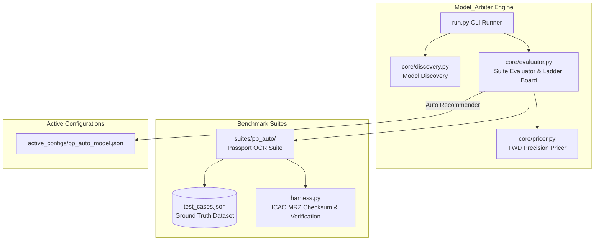

# Model_Arbiter — 專案核心架構與開發者手冊 (HANDBOOK.md)

> **Version**: v1.0.0-cli  
> **Target Engine**: Google Gemini API (Multimodal & Reasoning Models)  
> **Repository**: [Model_Arbiter GitHub](https://github.com/voyagermartin/Model_Arbiter.git)

---

## 1. Project Vision & Architecture

### 1.1 專案願景 (Project Vision)
`Model_Arbiter` 為跨專案共用的 **「Google Gemini 模型自動跑分、成本精算與最適模型推薦引擎」**。
在 LLM/VLM 技術快速迭代與 API 費率頻繁調整的背景下，許多企業應用（如 OCR 護照辨識、單據解析、複雜推理）過度依賴頂規高價模型（如 Pro 系列），造成龐大營運成本。

`Model_Arbiter` 透過自動化跑分測試與 Token 精度計費機制，即時比較各主流模型（如 Flash, Flash-Lite, Hybrid Reasoning 2.5 等）在真實任務下的 **正確率**、**響應延遲** 與 **台幣成本 (TWD)**，並自動產出最佳動態設定檔 `active_configs/<suite>_model.json`，供其他商業專案直接引用，達成「零破壞性更新、極致套利降本」目標。

### 1.2 系統架構圖 (Architecture Diagram)



### 1.3 CLI 運作與多專案套利機制 (Arbitrage Mechanism)
1. **競賽與跑分 (Benchmarking)**：執行特定 Suite 驗證候選模型（例如 2.0-flash vs 2.0-flash-lite vs 2.5-flash）。
2. **硬性驗收門檻 (100% Pass Rate)**：僅有 100% 通過 JSON 格式校驗、MRZ 數學邏輯驗算與關鍵欄位比對的模型才有資格進入套利遴選。
3. **成本極小化排序 (Min Cost Selection)**：在通過 100% 驗收的模型中，挑選每千次請求成本最便宜（NTD/TWD）的模型。
4. **組態自動匯出 (Active Config Export)**：自動寫入 `active_configs/pp_auto_model.json`。外部應用服務（如 Passport OCR 微服務）僅需讀取該 JSON 檔作為 API 調用目標，即刻完成成本套利。

---

## 2. Key Modules & Directory Structure

```plaintext
Model_Arbiter/
├── .gitignore          # Git 忽略設定（隱藏 API 密碼與 active_configs 實體 JSON）
├── HANDBOOK.md         # 專案核心架構與開發者手冊
├── README.md           # Quick Start 與簡易使用說明
├── requirements.txt    # 輕量依賴清單
├── run.py              # CLI 主入口腳本
├── core/
│   ├── __init__.py
│   ├── discovery.py    # 自動撈取 Google 官方活躍多模態模型
│   ├── pricer.py       # 官方費率對照表與 TWD 精算
│   └── evaluator.py    # 跑分評估與 active_model.json 輸出
├── suites/
│   ├── __init__.py
│   └── pp_auto/        # 護照/證件辨識測試套件
│       ├── __init__.py
│       ├── test_cases.json   # Ground Truth 驗證標準
│       └── harness.py        # 測試執行、MRZ 數學校驗與 Token 擷取
└── active_configs/
    └── .gitkeep        # Git 目錄追蹤檔
```

### 模組職責說明 (Module Responsibilities)
- **`run.py`**：CLI 指令解析器（`--list-models`, `--suite pp_auto`, `--mock`, `--models`）。
- **`core/discovery.py`**：透過 `google-genai` SDK 自動撈取 `ACTIVE` 且支援 `generateContent` 的模型，並自動標註已廢棄 (deprecated) 項目。
- **`core/pricer.py`**：維護官方 Gemini 費率表（以 1M tokens USD 計價，預設匯率 `32.0 TWD/USD`），準確計算法價、思考 (Thinking) 及輸出 Token 成本。
- **`core/evaluator.py`**：協調 Benchmark 執行，計算正確率、延遲與台幣成本，輸出 ASCII 對比天梯榜並產出推薦檔。
- **`suites/pp_auto/harness.py`**：包含 ICAO Doc 9303 護照 MRZ 7-3-1 數學校驗算法、JSON 結構合法性與 Token 數精確擷取。

---

## 3. Pricing & Evaluation Rules

### 3.1 Token 計費公式 (Pricing Formulas)

所有費用計算統一轉換為 **新台幣 (TWD)**，匯率預設值為 `1 USD = 32.0 TWD`。

$$\text{Total Cost (USD)} = \frac{\text{Prompt Tokens}}{1,000,000} \times \text{Rate}_{\text{input}} + \frac{\text{Candidate Tokens}}{1,000,000} \times \text{Rate}_{\text{output}} + \frac{\text{Thought Tokens}}{1,000,000} \times \text{Rate}_{\text{thought}}$$

$$\text{Total Cost (TWD)} = \text{Total Cost (USD)} \times 32.0$$

#### 主流模型基準費率表 (USD per 1M Tokens):
| 模型代碼 (Model ID) | Input Rate / 1M | Output Rate / 1M | Thought Rate / 1M | 思考 Token 支援 |
| :--- | :---: | :---: | :---: | :---: |
| `gemini-2.5-flash` | $0.10 | $0.40 | $0.40 | ✅ 支援 |
| `gemini-2.0-flash` | $0.10 | $0.40 | $0.40 | ✅ 支援 |
| `gemini-2.0-flash-lite` | $0.075 | $0.30 | $0.30 | ❌ 無 |
| `gemini-1.5-flash` | $0.075 | $0.30 | $0.30 | ❌ 無 |
| `gemini-1.5-pro` | $1.25 | $5.00 | $5.00 | ❌ 無 |

### 3.2 MRZ 校驗碼邏輯 (ICAO Doc 9303 MRZ Verification Rules)

護照第二行 (Line 2) 包含 5 組權重為 `[7, 3, 1]` 循環加權的檢查碼：
1. **護照號碼檢查碼** (位置 0:9 比對 位置 9)
2. **出生日期檢查碼** (位置 13:19 比對 位置 19)
3. **效期截止日檢查碼** (位置 21:27 比對 位置 27)
4. **個人號碼檢查碼** (位置 28:42 比對 位置 42)
5. **綜合檢查碼 (Composite Check Digit)** (位置 `0:10` + `13:20` + `21:28` + `28:43` 比對 位置 43)

公式：
$$\text{Check Digit} = \left( \sum_{i=0}^{N-1} \text{val}(c_i) \times w_{i \pmod 3} \right) \pmod{10}$$
其中字符映射：`'0'-'9' -> 0-9`, `'A'-'Z' -> 10-35`, `'<' -> 0`。

### 3.3 跑分評分與推薦標準
- **格式合規度**：必須符合 JSON Schema 規範。
- **數學精確度**：MRZ 檢查碼驗算必須 **100% 通過**（無任何計算錯誤）。
- **關鍵欄位符合**：英文姓名、護照號碼與 Ground Truth 100% 相符。
- **最適推薦機制**：在所有 100% 通過驗收的模型中，自動挑選 `cost_ntd` 最低者輸出至 `active_configs/pp_auto_model.json`。

---

## 4. Development & Verification Guide

### 4.1 CLI 常用指令 (CLI Usage)

```bash
# 1. 列出目前所有可用與活躍的多模態 Gemini 模型
python run.py --list-models

# 2. 執行護照辨識跑分測試 (使用預設/離線 Mock Harness 驗證)
python run.py --suite pp_auto --mock

# 3. 帶入真實 API Key 執行跑分測試
python run.py --suite pp_auto --api-key "YOUR_GEMINI_API_KEY"

# 4. 指定特定模型進行跑分測試
python run.py --suite pp_auto --models gemini-2.0-flash-lite gemini-2.0-flash --mock
```

### 4.2 本地編譯與驗證 (Verification Commands)
在提交程式碼前，請執行以下命令確認全模組零編譯錯誤：

```bash
python -m py_compile run.py core/*.py suites/pp_auto/*.py
```

### 4.3 Git 規範與部署約定
- 主分支名稱：`main`
- Commit 訊息規範：採用 Angular Conventional Commits (例如 `feat: ...`, `fix: ...`, `docs: ...`)。
- 遠端儲存庫：`https://github.com/voyagermartin/Model_Arbiter.git`

---

## 5. Roadmap & Version History

### 5.1 Milestone 日誌 — v1.0.0-cli
- [x] 完成 `.gitignore` 與 `requirements.txt` 輕量依賴設定。
- [x] 完成 `HANDBOOK.md` 核心架構與規範手冊編寫。
- [x] 實作 `core/discovery.py` 模型自動撈取與過濾器。
- [x] 實作 `core/pricer.py` 涵蓋 Thinking Token 之台幣精算器。
- [x] 實作 `suites/pp_auto/harness.py` ICAO 護照 MRZ 100% 數學校驗機制。
- [x] 實作 `core/evaluator.py` ASCII 對比天梯榜與最佳模型自動產出。
- [x] 實作 `run.py` CLI 主入口。
- [x] 通過全模組 `py_compile` 驗證並推送到 GitHub 遠端儲存庫。

### 5.2 未來展望 (Future Roadmap)
- [ ] v1.1.0: 擴充 `id_auto` (身分證/駕照辨識跑分套件)。
- [ ] v1.2.0: 支援 API Key 輪詢與配額 (Quota/RPM) 自動偵測。
- [ ] v2.0.0: 提供 RESTful Webhook，提供模型異動主動通知機制。
