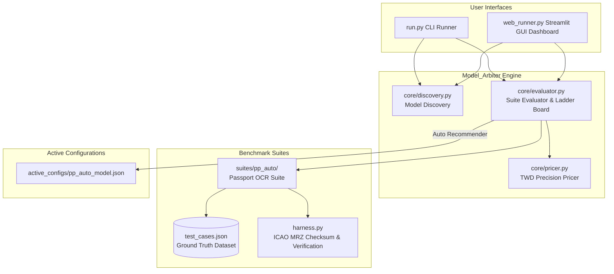

# Model_Arbiter — 專案核心架構與開發者手冊 (HANDBOOK.md)

> **Version**: v1.1.0-web  
> **Target Engine**: Google Gemini API (Multimodal & Reasoning Models)  
> **Repository**: [Model_Arbiter GitHub](https://github.com/voyagermartin/Model_Arbiter.git)

---

## 1. Project Vision & Architecture

### 1.1 專案願景 (Project Vision)
`Model_Arbiter` 為跨專案共用的 **「Google Gemini 模型自動跑分、成本精算與最適模型推薦引擎」**。
在 LLM/VLM 技術快速迭代與 API 費率頻繁調整的背景下，許多企業應用（如 OCR 護照辨識、單據解析、複雜推理）過度依賴頂規高價模型（如 Pro 系列），造成龐大營運成本。

`Model_Arbiter` 透過自動化跑分測試與 Token 精度計費機制，即時比較各主流模型（如 Flash, Flash-Lite, Hybrid Reasoning 2.5 等）在真實任務下的 **正確率**、**響應延遲** 與 **台幣成本 (TWD)**，並自動產出最佳動態設定檔 `active_configs/<suite>_model.json`，供其他商業專案直接引用，達成「零破壞性更新、極致套利降本」目標。

### 1.2 系統架構圖 (Architecture Diagram)



---

## 2. Key Modules & Directory Structure

```plaintext
Model_Arbiter/
├── .gitignore          # Git 忽略設定（隱藏 API 密碼與 active_configs 實體 JSON）
├── HANDBOOK.md         # 專案核心架構與開發者手冊
├── README.md           # Quick Start 與簡易使用說明
├── requirements.txt    # 輕量依賴清單 (google-genai, pydantic, pillow, tabulate, streamlit)
├── run.py              # CLI 主入口腳本
├── web_runner.py       # Streamlit 視覺化跑分監控面板
├── core/
│   ├── __init__.py
│   ├── discovery.py    # 自動撈取 Google 官方活躍多模態模型
│   ├── pricer.py       # 官方費率對照表與 TWD 精算
│   └── evaluator.py    # 跑分評估與 active_model.json 輸出
├── suites/
│   ├── __init__.py
│   └── pp_auto/        # 護照/證件辨識測試套件
│       ├── __init__.py
│       ├── test_cases.json   # Ground Truth 驗證標準
│       └── harness.py        # 測試執行、MRZ 數學校驗與 Token 擷取
└── active_configs/
    └── .gitkeep        # Git 目錄追蹤檔
```

---

## 3. Development & Verification Guide

### 3.1 視覺化 Web 面板 (Streamlit Dashboard)
```bash
streamlit run web_runner.py
```

### 3.2 CLI 常用指令 (CLI Usage)

```bash
# 1. 列出目前所有可用與活躍的多模態 Gemini 模型
python run.py --list-models

# 2. 執行護照辨識跑分測試 (使用預設/離線 Mock Harness 驗證)
python run.py --suite pp_auto --mock

# 3. 帶入真實 API Key 執行跑分測試
python run.py --suite pp_auto --api-key "YOUR_GEMINI_API_KEY"
```

### 3.3 本地編譯與驗證 (Verification Commands)

```bash
python -m py_compile run.py web_runner.py core/*.py suites/pp_auto/*.py
```
