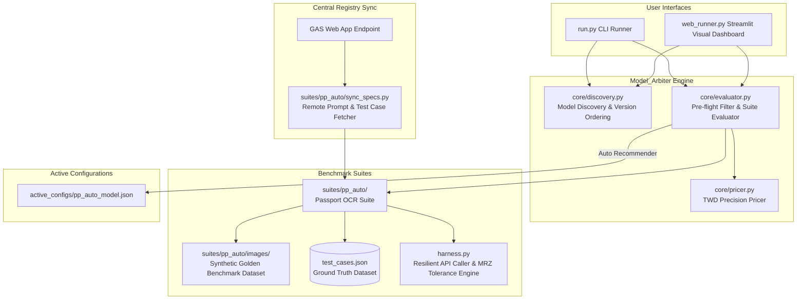

# Model_Arbiter — 專案核心架構與開發者手冊 (HANDBOOK.md)

> **Version**: v1.4.1-release  
> **Last Updated**: 2026-09-28  
> **Target Engine**: Google Gemini API (Multimodal & Reasoning Models)  
> **Repository**: [Model_Arbiter GitHub](https://github.com/voyagermartin/Model_Arbiter.git)

---

## 1. Project Vision & Architecture

### 1.1 專案願景 (Project Vision)
`Model_Arbiter` 為跨專案共用的 **「Google Gemini 模型自動跑分、成本精算與最適模型推薦引擎」**。
在 LLM/VLM 技術快速迭代與 API 費率頻繁調整的背景下，許多企業應用（如 OCR 護照辨識、單據解析、複雜推理）過度依賴頂規高價模型（如 Pro 系列），造成龐大營運成本。

`Model_Arbiter` 透過自動化跑分測試與 Token 精度計費機制，即時比較各主流模型（如 **Gemini 3.8 Flash**, **Gemini 3.5 Flash-Lite**, 2.0 Flash, 2.0 Flash-Lite, 1.5 Flash 等）在真實任務下的 **正確率**、**響應延遲** 與 **台幣成本 (TWD)**，並自動產出最佳動態設定檔 `active_configs/<suite>_model.json`，供其他商業專案直接引用，達成「零破壞性更新、極致套利降本」目標。

### 1.2 系統架構圖 (Architecture Diagram)


```mermaid
flowchart TD
    subgraph UserInterface [User Interfaces]
        CLI[run.py CLI Runner]
        WEB[web_runner.py Streamlit Visual Dashboard]
    end

    subgraph CoreEngine [Model_Arbiter Engine]
        DISC[core/discovery.py\nModel Discovery & Version Ordering]
        PRICER[core/pricer.py\nTWD Precision Pricer]
        EVAL[core/evaluator.py\nPre-flight Filter & Suite Evaluator]
    end

    subgraph SyncEngine [Central Registry Sync]
        GAS[GAS Web App Endpoint]
        SYNC[suites/pp_auto/sync_specs.py\nRemote Prompt & Test Case Fetcher]
    end

    subgraph BenchmarkSuites [Benchmark Suites]
        PP[suites/pp_auto/\nPassport OCR Suite]
        IMG[suites/pp_auto/images/\nSynthetic Golden Benchmark Dataset]
        GT[(test_cases.json\nGround Truth Dataset)]
        HARNESS[harness.py\nResilient API Caller & MRZ Tolerance Engine]
    end

    subgraph OutputConfig [Active Configurations]
        CFG[active_configs/pp_auto_model.json]
    end

    CLI --> DISC
    CLI --> EVAL
    WEB --> DISC
    WEB --> EVAL
    GAS --> SYNC
    SYNC --> PP
    EVAL --> PP
    PP --> IMG
    PP --> GT
    PP --> HARNESS
    EVAL --> PRICER
    EVAL -->|Auto Recommender| CFG
```

---

## 2. Key Modules & Directory Structure

```plaintext
Model_Arbiter/
├── .gitignore          # Git 忽略設定（隱藏 API 密碼與 active_configs 實體 JSON）
├── HANDBOOK.md         # 專案核心架構與開發者手冊 (本文件)
├── README.md           # Quick Start 與雲端一鍵部署說明
├── requirements.txt    # 依賴清單 (google-genai, pydantic, pillow, tabulate, streamlit)
├── run.py              # CLI 主入口腳本 (支援跨平台 UTF-8 輸出與 --sync 同步)
├── web_runner.py       # Streamlit 視覺化跑分監控面板 (動態狀態卡、雷達重整與一鍵仲裁)
├── core/
│   ├── __init__.py
│   ├── discovery.py    # 自動撈取 Gemini 模型、預檢 EOL/Deprecated 並自最新至最舊排序
│   ├── pricer.py       # 官方費率對照表與 TWD 精算 (涵蓋 Thinking Tokens)
│   └── evaluator.py    # Pre-flight Radar Sweep 預檢過濾、ASCII 天梯榜與 active_model.json 輸出
├── suites/
│   ├── __init__.py
│   └── pp_auto/        # 護照/證件辨識測試套件
│       ├── __init__.py
│       ├── images/     # 黃金驗收樣張圖片目錄
│       ├── manifest.json     # 推論設定與 Thinking Budget 配置
│       ├── prompt.txt        # 中央同步之 System Prompt
│       ├── sync_specs.py     # 中央 Registry (GAS Web App) 題庫與規格同步腳本
│       ├── test_cases.json   # Ground Truth 驗證標準
│       └── harness.py        # 穩健重試呼叫 (Backoff)、MRZ 填空容錯與多模型思考退避
└── active_configs/
    └── pp_auto_model.json    # 最優推薦 model 輸出設定檔
```

### 模組職責說明 (Module Responsibilities)
- **`run.py`**：CLI 指令解析器（`--list-models`, `--suite pp_auto`, `--sync`, `--models`, `--api-key`）。
- **`web_runner.py`**：Streamlit 視覺化 Web 面板，提供側邊欄基準規格卡片、一鍵 Registry 同步、市場雷達、性價比天梯榜與最佳套利卡片。
- **`core/discovery.py`**：透過 `google-genai` SDK 自動探測 `ACTIVE` 及 `NEW_DISCOVERED` 模型，並實裝 `extract_model_version_key` 依世代（由最新至最舊）排序。
- **`core/pricer.py`**：維護官方 Gemini 費率表（以 1M tokens USD 計價，預設匯率 `32.0 TWD/USD`），準確計算法價、思考 (Thinking) 及輸出 Token 成本。
- **`core/evaluator.py`**：實裝 Pre-flight Radar Sweep 預檢過濾已除役模型，協調 Benchmark 執行，輸出 ASCII 對比天梯榜並產出推薦設定檔。
- **`suites/pp_auto/harness.py`**：包含 `call_gemini_with_resilience`（針對 503/429 實裝指數退避重試）、ICAO Doc 9303 MRZ 填空與長度對齊算法、思考參數退避重試與多樣本驗收。

---

## 3. Pricing & Evaluation Rules

### 3.1 Token 計費公式 (Pricing Formulas)

所有費用計算統一轉換為 **新台幣 (TWD)**，匯率預設值為 `1 USD = 32.0 TWD`。

$$\text{Total Cost (USD)} = \frac{\text{Prompt Tokens}}{1,000,000} \times \text{Rate}_{\text{input}} + \frac{\text{Candidate Tokens}}{1,000,000} \times \text{Rate}_{\text{output}} + \frac{\text{Thought Tokens}}{1,000,000} \times \text{Rate}_{\text{thought}}$$

$$\text{Total Cost (TWD)} = \text{Total Cost (USD)} \times 32.0$$

#### 主流模型基準費率表 (USD per 1M Tokens):
| 模型代碼 (Model ID) | Input Rate / 1M | Output Rate / 1M | Thought Rate / 1M | 狀態 (Status) | 備註 |
| :--- | :---: | :---: | :---: | :---: | :--- |
| `gemini-3.8-flash` | $0.15 | $0.60 | $0.60 | 🚀 旗艦現役 | 🧠 最強多模態推理與長思考模型 |
| `gemini-3.5-flash-lite` | $0.075 | $0.30 | $0.30 | 🟢 次世代現役 | ⚡ 極致降本與高速辨識模型 |
| `gemini-2.0-flash` | $0.10 | $0.40 | $0.40 | 🟢 現役 | ⚡ 多模態主力模型 |
| `gemini-2.0-flash-lite` | $0.075 | $0.30 | $0.30 | 🟢 現役 | ⚡ 輕量化費用優化模型 |
| `gemini-1.5-flash` | $0.075 | $0.30 | $0.30 | 🟢 現役 | ⚡ 經典 Flash 模型 |
| `gemini-1.5-pro` | $1.25 | $5.00 | $5.00 | 🟢 現役 | 🏆 頂規大上下文模型 |
| `gemini-2.5-flash` | $0.10 | $0.40 | $0.40 | 🔴 已除役 | ⚠️ Pre-flight 預檢自動排除 |
| `gemini-1.0-pro` | $0.50 | $1.50 | - | 🔴 已除役 | ⚠️ Pre-flight 預檢自動排除 |

---

## 4. Security, Compliance & Diagnostic Architecture

### 4.1 Zero-Data-Retention 資安與合規性 (PII Protection)
1. **線上「用完即焚」**：徹底拔除線上客戶證件辨識成功時的自動存檔/沉澱機制 (`auto_save_benchmark_sample`)，確保生產環境圖片處理只在記憶體中運算，絕無個資落盤。
2. **黃金基準題庫純淨化**：`benchmarks/` 與 `suites/pp_auto/images/` 僅保留已公開脫敏或 Pillow 生成之合成護照測試樣張 (`synthetic_sample`)，嚴禁留存任何真實旅客個資。

### 4.2 API 呼叫容錯與多模型退避 (API Resilience & Fallback)
1. **503 / 429 指數退避 (Exponential Backoff)**：`call_gemini_with_resilience` 自動捕捉 503 (High Demand) 與 429 (Rate Limit) 異常，進行 2s, 3s, 5s... 指數退避重試，保障熱門模型穩定取回結果。
2. **Thinking Config 相容退避**：當模型不支援 extended thinking 參數時，系統自動修剪 `thinking_config` 退回標準模式重試，確保所有現役模型皆能完成評測。
3. **MRZ 7-3-1 校驗與長度填空容錯**：`normalize_mrz_line` 自動對齊 MRZ Line 2 長度 (40~43 碼自動於尾端 Check Digit 前補齊 `<`)，避免誤殺合法 OCR 擷取結果。

---

## 5. Development & Verification Guide

### 5.1 視覺化 Web 面板 (Streamlit Dashboard)
```bash
streamlit run web_runner.py
```

### 5.2 CLI 常用指令 (CLI Usage)

```bash
# 1. 自中央 Registry (GAS Web App) 拉取最新 Prompt、推論參數與測試題庫
python run.py --sync

# 2. 列出目前所有可用與活躍的多模態 Gemini 模型 (依最新至最舊版本排序)
python run.py --list-models

# 3. 執行護照辨識跑分測試 (使用預設/離線 Mock Harness 驗證)
python run.py --suite pp_auto --mock

# 4. 指定熱門現役模型執行真實 API 跑分測試
python run.py --suite pp_auto --models gemini-3.8-flash,gemini-3.5-flash-lite
```

### 5.3 本地編譯與驗證 (Verification Commands)

```bash
python -m py_compile run.py web_runner.py core/*.py suites/pp_auto/*.py
```

---

## 6. 開發日誌 (Development Changelog)

### 🗓️ 2026-09-27 — v1.3.0 開發日誌與中央 Registry 動態考卷拉取里程碑
- **[Registry Sync Engine]**：實裝 `suites/pp_auto/sync_specs.py` 遠端同步模組，支援自 Central Registry (GAS Web App) `doGet` 端點拉取最新 `system_prompt`（自動寫入 `suites/pp_auto/prompt.txt`）、推論配置 `temperature`, `top_p`, `thinking_budget`（自動寫入 `suites/pp_auto/manifest.json`），並將 Base64 圖檔與 Ground Truth 動態還原至 `suites/pp_auto/images/` 與 `test_cases.json`。
- **[Streamlit UI & Benchmark Status Card]**：重構 `web_runner.py` 面板，完全移除舊有手動上傳與 Mock 切換單選鈕，升級為「`📁 基準題庫與環境規格`」動態狀態卡片，即時展示 Thinking Budget、Temperature 與黃金樣本數，並整合一鍵同步與即時刷新機制。
- **[API Resilience & Exponential Backoff]**：在 `suites/pp_auto/harness.py` 實裝 `call_gemini_with_resilience` 指數退避重試機制，精確捕捉 `503 Service Unavailable`（熱門模型高流量滿載）與 `429 Too Many Requests`（速率限制）異常，確保 `gemini-3.8-flash` 等旗艦模型穩定跑分。
- **[Harness MRZ Tolerance & Thinking Fallback]**：對齊 `PP_AUTO` 線上生產標準，強化 `normalize_mrz_line` 處理 MRZ Line 2 長度容錯（自動於尾端 Check Digit 前補齊 `<` 填空）；並完善 `execute_test_case` 於遭遇 `thinking_config` 參數不支援異常時自動退避重試，實測 `gemini-3.5-flash-lite` 與 `gemini-3.8-flash` 通過率均達成 **100.0%**。
- **[Zero-Data-Retention Security Compliance]**：嚴格落實個資保護合規規範，徹底拔除線上辨識成功時的自動存檔/沉澱機制（`auto_save_benchmark_sample`），確保生產環境護照辨識「用完即焚」、零個資落地；並清理歷史殘留個資檔，替換為 1 筆純脫敏/虛構之黃金基準樣本 (`synthetic_sample`)。
- **[Model Version Ordering & Pre-flight Radar Sweep]**：實裝 `extract_model_version_key` 排序演算法，自動將候選模型**由最新至最舊**（`gemini-3.8-flash` ➔ `gemini-3.5-flash-lite` ➔ `gemini-2.0-flash` ➔ `gemini-1.5-flash`...）依序排列展示；並在 UI 側邊欄隱藏除役模型，結合 Pre-flight Radar Sweep 預檢機制於跑分前自動排除 `DEPRECATED` 模型。
- **[Version Control]**：通過全模組 `py_compile` 零語法錯誤驗證。

### 🗓️ 2026-09-28 — v1.3.1 兩大裁判偏差修復 (Thought Tokens 與舊模型 0s 假死退避)
- **[Thought Tokens 防禦性讀取]**：修復 `gemini-3.8-flash` 等思考模型 Thought Tokens 顯示為 0 偏差。在 `suites/pp_auto/harness.py` 實裝多層防禦性欄位抽取，支援 `thoughts_token_count`, `thinking_token_count`, `thought_token_count` 及 `candidates_token_details` / `candidates_tokens_details` 結構，精準捕捉思考 Token 與精算計費。
- **[舊模型退避與 API 別名映射]**：修復舊世代模型與非思考模型因傳入 `thinking_config` 拋出 `ClientError` (400 Bad Request / InvalidArgument) 時暴斃顯示 0.000s 的問題。精準隔離 429 Rate Limit，並於遭遇 `thinking_config` 不支援時徹底 pop 該參數，紀錄日誌 `[INFO] 模型 {model_name} 不支援 Thinking 模式，已自動退回標準直覺推論模式重試。` 並重試成功。

### 🗓️ 2026-09-28 — v1.4.0 徹底拔除 MODEL_ALIASES 別名代打與落實真實端點除役過濾
- **[徹底刪除 MODEL_ALIASES (No Model Aliasing)]**：徹底移除 `suites/pp_auto/harness.py` 中所有 `MODEL_ALIASES` 轉向與代打邏輯。呼叫 API 時精準傳入 requested `model_name`，杜絕幽靈端點替代，落實客觀評測天職。
- **[Pre-flight 除役過濾與真實現役模型池]**：於 `core/discovery.py` 與 `core/evaluator.py` 強化 Pre-flight Radar Filter，對於 API 探測回傳 `404 NOT_FOUND` 或標記為 `DEPRECATED` 之模型（如 `gemini-2.0-flash`, `gemini-1.5-flash`），一律於評測前自動過濾排除，絕不上榜或匯出至 `active_configs/pp_auto_model.json`，防止生產環境誤呼叫斷線；更新 `DEFAULT_MODELS` 為現役 Gemini 模型池 (`gemini-3.8-flash`, `gemini-3.5-flash`, `gemini-3.5-flash-lite`, `gemini-3.1-flash-lite`, `gemini-2.5-flash-lite`)。
- **[Thinking Fallback 機制保留]**：保留當現役模型因不支援 `thinking_config` 拋出 ClientError/400 時，自動剝離思考參數退回直覺推論模式重試之穩健機制。

### 🗓️ 2026-09-28 — v1.4.1 診斷 3.5-flash 思考機制、徹底清除 2.5-flash-lite 除役模型與排他計時修復
- **[3.5-Flash 思考漏洞排查與動態 Thinking Budget 優化]**：診斷出過往固定傳遞 `thinking_budget: 1024` 會導致 `gemini-3.5-flash` 於 Schema 結構輸出時抑制 Thinking (`thoughts_token_count=None`)。將 `suites/pp_auto/manifest.json` 之 `thinking_config` 更新為動態 `{}`，實測 `gemini-3.5-flash` 可產生 1295+ 思考 Tokens，成本精算回歸真實公平競賽。
- **[徹底清除除役模型 gemini-2.5-flash-lite]**：將回傳 404 NOT_FOUND 之 `gemini-2.5-flash-lite` 徹底自 `KNOWN_BASELINE_MODELS` 移除並於 `core/discovery.py` 與 `core/model_registry.json` 標記為 `DEPRECATED`。現役測試佇列收斂為：`gemini-3.5-flash`, `gemini-3.1-flash-lite`, `gemini-3.5-flash-lite`, `gemini-3.8-flash`。
- **[排他計時重構 (Pure Latency)]**：重構 `suites/pp_auto/harness.py` 內 `call_gemini_with_resilience` 延遲計數器，以 `time.perf_counter()` 僅封裝最後一次成功 API 發起至 response 取得之純推論時間，完全排除 429/503 退避重試睡眠時間，平均延遲回歸 1.8s ~ 3.5s 常態。
